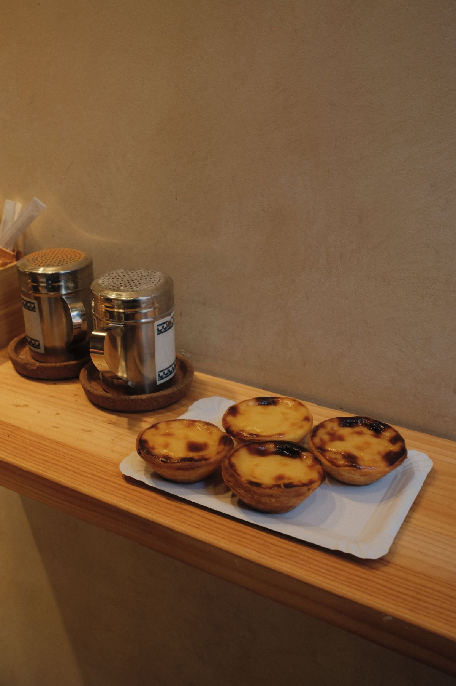

# Welcome to My GitHub Pages Site
I'm Victoria, a third year Computer Science major and transfer student at [UCSD](https://www.ucsd.edu/).

## About Me
- I have experience in **web development**.
- I like coding with Java, HTML/CSS, C++, SQL, and PHP.
- I used to figure skate, but now I skate only for fun.
- [View the README file](./README.md)
- I love traveling and my most recent trip was to Portugal.

My favorite quote that I have recently come across:
> "Problems are not stop signs, they are guidelines." - Robert Schuller

## Learning goals
- [] Practice JavaScript, rather than using Bootstrap.
- [] Learn to work with a large team, since I have only worked with small ones before.
- [] Learn about the general Software Engineering process.
- [] Get more comforable with Git and GitHub, especially `git merge`.

## Education
Classes I am taking this quarter include 
1. CSE 153
2. CSE 105
3. CSE 150A
4. CSE 110

[Jump to Learning Goals](#learning-goals)
